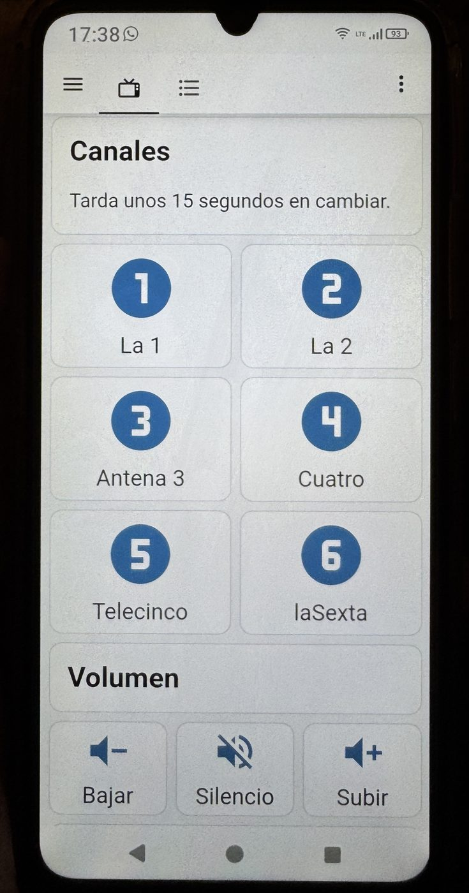

# Tele Fácil

Manejar la televisión desde un panel de botones grandes —en una tablet, en el
móvil o en cualquier pantalla— en vez de con el mando del decodificador: seis
canales, volumen y poco más. Corre sobre **Home Assistant** en una Raspberry Pi.

Nació para que una persona mayor pudiera ver la tele sin pelearse con un mando
de cuarenta botones. Quien lo usa no tiene por qué saber que detrás hay nada.

```
Panel de botones  →  Home Assistant  →  Android TV Remote  →  Decodificador  →  TV
                                     └→  ADB (para lo que el mando no cubre)
```

> **[Solo quiere ver la tele](https://dibanez.github.io/tele-facil/)** — el porqué
> del proyecto: qué problema resuelve, qué costó y cuánto costaría añadirle voz.

<p align="center">
  
</p>
<p align="center"><em>Esto es todo lo que ve quien lo usa.</em></p>

## Decodificadores soportados

| Decodificador | Estado |
|---|---|
| **DIGI R2A** | Verificado contra un equipo real el 2026-08-19: volumen, silencio, navegación y el cambio a los seis canales generalistas funcionan de principio a fin |

Solo hay uno por ahora. El proyecto está partido en capas precisamente para que
añadir otro no obligue a rehacerlo: ver
[Añadir otro decodificador](#añadir-otro-decodificador). Los detalles medidos
—tiempos, teclas que el deco ignora— están en
[Cómo funciona el cambio de canal](#cómo-funciona-el-cambio-de-canal) y en las
[limitaciones](#limitaciones-conocidas).

## Qué hace falta

| Pieza | Notas |
|---|---|
| Un **decodificador soportado** | Encendido y en la misma red que la Raspberry. Hoy, el DIGI R2A |
| **Raspberry Pi** con Home Assistant | Probado sobre HA OS; requiere **HA 2024.8 o superior** por la sintaxis `action:` |
| Integración **Android TV Remote** | Es la vía principal: se empareja una vez con un código en pantalla y sobrevive a reinicios |
| Integración **Android Debug Bridge** | Solo para lanzar el enlace `digitv://channel`. Es lo único que el mando de Google TV no sabe hacer |
| Red sin aislamiento de clientes | Y reservas DHCP por MAC para la Raspberry y el deco |

## Instalación

Los pasos completos, con su verificación en cada fase, están en
**[docs/01-despliegue.md](docs/01-despliegue.md)**. En resumen:

**1. Comprueba que el deco es alcanzable y qué vía admite.** Con el deco
encendido y mostrando imagen, desde la Raspberry o cualquier equipo de la misma
red:

```bash
python3 tools/probe_deco.py
```

No necesita dependencias: descubre por mDNS, barre la subred y dice si hay
Android TV Remote (recomendado), ADB, o solo señal de vida.

**2. Empareja las integraciones.** En Home Assistant, *Ajustes → Dispositivos y
servicios → Añadir integración*: **Android TV Remote** con la IP del deco
(aparecerá un código en el televisor), y **Android Debug Bridge** apuntando a
`<ip-del-deco>:5555`.

> ADB en el R2A no se activa con el método clásico de pulsar siete veces sobre
> "Número de compilación": hay que instalar una app de *Developer Tools* desde
> Google Play y activar desde ella la depuración por red.

**3. Copia la configuración.**

```bash
cp homeassistant/packages/tele_facil.yaml <config>/packages/
```

Y añade a `configuration.yaml` la línea de `packages:` que aparece en
[`homeassistant/configuration.snippet.yaml`](homeassistant/configuration.snippet.yaml).
Reinicia Home Assistant.

**4. Ajusta los valores de tu instalación** (ver tabla siguiente) y crea el
panel con [`homeassistant/dashboards/tv.yaml`](homeassistant/dashboards/tv.yaml):
*Ajustes → Paneles → Añadir panel → Editar en YAML* y pega el contenido.

### Valores que hay que personalizar

Ninguna IP real viaja en el repositorio. Estos tres valores son de ejemplo y
hay que cambiarlos por los de la instalación:

| Dónde | Clave | Qué poner |
|---|---|---|
| `homeassistant/packages/tele_facil.yaml` | `target_remote` | El `entity_id` que crea Android TV Remote, normalmente `remote.digi_r2a` |
| `homeassistant/packages/tele_facil.yaml` y `dashboards/tv.yaml` | `media_player.android_tv_192_168_1_20` | La entidad de ADB: Home Assistant la nombra con la IP del deco, con guiones bajos |
| `homeassistant/configuration.snippet.yaml` | `host_ip` / `advertise_ip` | La IP fija de la Raspberry |

Todos los sitios donde aparecen están marcados con un comentario `# CAMBIAR`.

## Cómo está organizado

```
tools/probe_deco.py                       Diagnóstico de red: encuentra el deco
                                          y dice qué vía de control admite
homeassistant/packages/tele_facil.yaml    Los scripts de control (el núcleo)
homeassistant/dashboards/tv.yaml          El panel de botones grandes
homeassistant/configuration.snippet.yaml  Bloques para configuration.yaml
docs/                                     Despliegue, mantenimiento, acceso remoto
```

Los scripts están en tres capas, y esa separación es lo único que hace viable
soportar más de un decodificador:

| Capa | Script | Qué sabe |
|---|---|---|
| 1 | `tv_send_key` | **Cómo se alcanza el deco.** Es el único script que toca el hardware: manda una tecla por Android TV Remote y, si la entidad está `unavailable` (el deco se reinició, la WiFi parpadeó), recarga la integración y espera a que vuelva antes de rendirse. Pasar a ADB o a un emisor de infrarrojos es editar este script y nada más |
| 2 | `tv_canal` | **Cómo se llega a un canal.** Es la parte específica del modelo: aquí está la implementación del DIGI R2A |
| 3 | `tv_la1`, `tv_volumen_mas`… | **Qué pide el usuario.** Una acción por cosa. Es lo que ven los botones del panel, y lo único que no debería cambiar nunca |

## Cómo funciona el cambio de canal

Esta es la parte que costó, y la razón de que el proyecto exista en vez de ser
cuatro líneas de YAML.

**El R2A no acepta entrada numérica.** Marcar `2` no cambia de canal, ni
pulsando después `OK`. Los dígitos van al firmware del decodificador, no a la
app `ro.digionline.tv` que corre encima, y en la pantalla de directo no hacen
nada. Tampoco responden `KEYCODE_CHANNEL_UP` / `DOWN` ni las flechas.

La única vía que funciona es navegar la rejilla de Canales de la app:

```
enlace digitv://channel  →  esperar 6 s  →  N flechas derecha  →  OK  →  esperar 5 s  →  OK
```

Cuatro detalles que hacen que esto sea fiable y no un castillo de naipes:

1. **El enlace `digitv://channel` deja siempre el foco en la posición 1**, esté
   el deco donde esté (guía abierta, ficha, ajustes). Es un punto de partida
   fijo, así que contar posiciones es absoluto y cada orden se autocorrige.
2. **En la ficha del programa, "Ver ahora" ya viene enfocado.** Mandar `ABAJO`
   antes del `OK` mueve el foco a la fila "Similares" y acabas viendo otro
   programa.
3. **Las pulsaciones van sueltas y espaciadas ~0,8 s.** Con `num_repeats` la
   integración las manda demasiado rápido y el foco se escapa al menú lateral.
4. **`androidtv.adb_command` corta cualquier comando que pase de ~9 s** y
   devuelve HTTP 200 igualmente: el fallo es silencioso. Por eso las esperas
   viven en `delay:` de Home Assistant y nunca dentro del comando.

El script usa `mode: restart`: en un panel táctil es fácil pulsar dos canales
seguidos, y con cola el segundo esperaría 20 s mientras la tele pasa por un
canal que nadie pidió. Como toda secuencia empieza por el enlace, cortar a
medias no deja nada roto.

## Añadir otro decodificador

La capa 3 —lo que el usuario pide— es la misma para cualquier deco: "pon
Telecinco" significa lo mismo en un R2A que en un Movistar Plus+. Lo que cambia
es cómo se cumple. Por eso portar el proyecto es, en principio:

1. **Capa 1:** si el deco es Android TV, `tv_send_key` sirve tal cual y solo hay
   que apuntar `target_remote` a la entidad nueva. Si no lo es (Linux
   propietario, solo infrarrojos), se reescribe ese único script.
2. **Capa 2:** reescribir `tv_canal`. Es el trabajo de verdad, y el que hay que
   medir contra el aparato: qué teclas ignora, cuánto tarda en pintar cada
   pantalla, si hay algún punto de partida fijo del que contar.
3. **Capa 3:** ajustar las posiciones de canal, sin tocar nada más.

El truco que hizo funcionar el R2A —encontrar una acción que deje la interfaz
siempre en el mismo sitio y contar desde ahí, en vez de asumir dónde estaba— es
probable que sirva en otros decos. La sección anterior cuenta cómo se llegó a
él, que es lo más reaprovechable de este repositorio.

## Limitaciones conocidas

- **El cambio de canal tarda 12-18 segundos.** Hay que navegar la rejilla; no
  hay atajo. El volumen y la navegación son instantáneos.
- **La posición 1 es "La 1 Galicia"**, no la nacional.
- **Los nombres de programa no identifican el canal**: cambian con la hora.
  Para verificar cuál está puesto, pulsa `ARRIBA` durante la reproducción y lee
  la barra de información.
- **Si el operador reordena la rejilla, hay que reajustar las posiciones.** Se edita
  el valor `posicion:` del script del canal afectado, y nada más.
- **ADB se desactiva solo tras un reinicio en muchos Android TV.** Por eso el
  mando de Google TV es la vía principal y ADB queda reducido al enlace.

## Diagnóstico

De fuera hacia dentro, cada paso descarta una capa:

1. ¿Abre `http://<ip-raspberry>:8123/`? → si no, Raspberry apagada o sin red.
2. ¿La entidad `remote.*` está `unavailable`? → deco apagado o cambió de IP.
3. ¿`python3 tools/probe_deco.py` encuentra el deco? → si no, problema de red o
   se perdió el emparejamiento.

El detalle, los fallos habituales y el mantenimiento periódico están en
[docs/03-mantenimiento.md](docs/03-mantenimiento.md).

## Documentación

| Documento | Contenido |
|---|---|
| [docs/01-despliegue.md](docs/01-despliegue.md) | Instalación por fases, con verificación en cada una |
| [docs/03-mantenimiento.md](docs/03-mantenimiento.md) | Diagnóstico de fallos y mantenimiento |
| [docs/04-tailscale.md](docs/04-tailscale.md) | Acceso remoto para dar soporte sin abrir puertos |

## Licencia

[MIT](LICENSE).

Proyecto personal, sin relación con DIGI ni con ningún operador. Los nombres
de operadores y canales son marcas de sus titulares.
